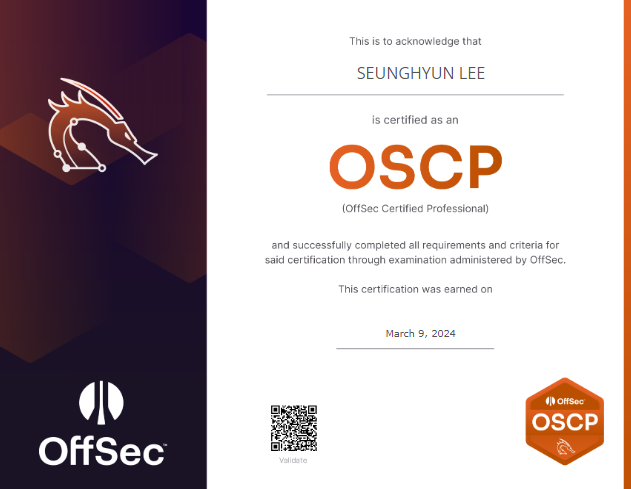
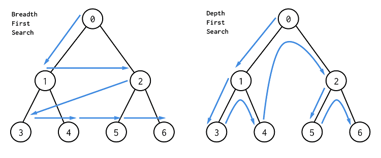

# Intro 
## 목차 
1. 매니저 소개
2. 간단한 보안 직무 소개
3. 향후 활동 소개
4. mindset

## 매니저 소개

- 이름 : 이승현 (00년생)
- 20학번 / 고스트 31기
- 보유 자격증
    - 리눅스 마스터 1급
    - OSCP 
        
## 보안 직무 소개 

보안을 소방을 비유하여 이해해 봅시다...

화재 방지와 대처를 위한 정책(소방법)을 만들고 운영하는 직업도 있을 것이고, 이러한 정책을 토대로 건물과 시설을 만드는 사람들이 있을 것이고, 이러한 시설물들이 소방법을 잘지키고 있는지 화재의 원인이 될만한 곳은 없는지 점검하는 직업도 있을 것이고, 화재가 발생하는지 안하는지 실시간으로 감시하는 직업도 있을 것이고, 스프링 쿨러와 같이 화재 방지 시설을 관리하는 사람이 있을 것이고,실제 화재가 난다면 출동할 소방관도 있을 것이고, 그 이후에 화재 현장을 조사하는 직업도 있을 것입니다. 각각에 비유에 해당하는 직업은 다음과 같습니다.

- 정책 : 사내 보안정책팀
- 만드는 사람 : 개발자
- 점검 : 모의 해킹(보안 컨설팅)
- 감시 : 보안 관제
- 장비 관리 : 보안 솔류션 운영자
- 소방관 : CERT (침해 대응팀)
- 사후 조사 : 포렌식

물론 이외에도 더 많은 보안과 관련된 직업(ex : 보안 솔루션 개발자)이 존재하고 구분 기준도 다르거나 모호한 경우도 있다. 여기서 우리는 모의해킹 분야에 대해 관심을 갖고 학습을 진행할 것이다.

### 모의 해킹
보안 컨설팅, 모의 해킹, 레드팀, 화이트 해킹 등등 수많은 단어가 비슷한 직종을 가리키는 것으로 쓰인다. 이 직종들의 공통점이라면 보안을 공격자의 관점에서 바라본다는 것이다. (Offensive security) 다시 말해 보안적 허점을 찾고 이를 수정하는 올바른 방법을 제시하는 것이 이들의 주요 업무라고 할 수 있다. 그러나 이 직종은 비슷한 말로 혼동이 될 수 있으나 명확한 한개의 분류의 기준에 따라 두가지로 나눌 수 있다. 그 기준은 바로 직접적인 공격 수행까지 이어지는가이다.

- 체크리스트
    - 체크리스트를 기반으로 한 취약점 진단
    - 보안 컨설팅에 필수로 들어가는 내용
    - 취약점 발견까지만 진행하고 실제 공격은 진행하지 않는다.
    - 낮은 진입 장벽
    - 상대적 낮은 연봉, 낮은 성장성
- 펜터스터 (레드팀)
    - 체크리스트도 사용하지만..
    - 능동적으로 취약점을 탐색하고
    - 발견한 취약점을 기반으로 실제 공격을 수행하고
    - 공격 성공 후 사후 공격(post exploit) 등의 시나리오 기반으로 업무를 수행한다.
    - 높은 진입 장벽
    - 상대적 높은 연봉, 높은 성장성 (꾸준한 연구와 공부를 요함)

우리는 펜터스터 entry level의 지식을 학습하고 실습할 것이다.

## 활동 소개

- 여러분들은 3인 1개 조로 해킹팀을 꾸리게 될 것입니다. 
    - 개인 사정등을 고려하여 팀 인원 수는 조정될 수 있습니다.
    - 개인별 수준을 고려하여 팀 구성을 지속적으로 변경될 수 있습니다.
- 아침에 탐색 방법이나 취약점 및 공격에 관한 강의를 수강하게 될 것입니다.
    - 해킹에 대한 지식은 cs 배경지식을 많이 필요로 합니다. 강의에서 이해되지 않았던 단어에 대해 반드시 정리하고 공부하셔야 합니다.
    - 강의 내용은 그 날 배우고 끝나는 것이 아닌 끝까지 활용될 수 있는 지식들이므로 스스로 정리하고 생각하는 것이 중요합니다.
- 이후 매니저가 각 조에게 학습 혹은 해킹 과제를 부여할 것입니다.
    - 각 과제는 0.5(반나절)~3일까지의 종료기간이 있습니다. 조 내에서 함께 협력하여 과제를 완료하셔야 합니다.
    - 과제를 진행하면서 시도했던 과정들을 상세히 기록하셔야 합니다. (성공 실패와 상관없이)
    - 또한 자신이 어떠한 생각을 했는지도 상세히 기록하셔야 합니다.
    - 과제에 따라 중간 결과와 그 과정을 다른 조들과 서로 발표하는 시간을 갖는 경우도 있습니다.
    - 각 팀별로 일정 시간에 한번 현재 진행 상황을 매니저에게 보고하고 힌트를 구할 수 있습니다.
    - 모든 AI 툴을 허용합니다 (오히려 권장합니다)
    - nessus와 같은 종류의 취약점 탐색 툴을 금지합니다.
    - 인터넷에서 답안을 검색하거나 다운로드하는 것을 금지합니다. (아너코드)
    - 결과와 과정을 함께 평가합니다.
- 저녁에는 기본적으로 주어진 과제에 대한 풀이를 진행합니다.

## mindset

### 낮은 곳이 아닌 높은 곳에 기준을 맞춥시다. 
- 배워서 남주려면 남들보다 훨씬 많이 깊게 알아야 합니다.
- 취업시장의 경쟁자는 한동대생이 아닙니다.
- 수동적인 사람은 결국 대체 가능한 인력이 될 수 밖에 없습니다.
- 열심히 할 방법이 아닌 잘할 방법을 고민(연구)해야 합니다.

### AI는 새로운 추월차선이 될 수 있습니다.
- chatgpt는 개발분야에서 뛰어난 성능을 보이지만 보안과 해킹 분야에서는 약한 모습을 보입니다. (오히려 고의적으로 답변을 제한하는 모습도 있음)
- 그러나 넓게 보면 보안과 이해하고 해킹을 하려면 폭 넓은 cs, 개발 지식이 필요로 합니다.
- 따라서 분야 맞게 AI를 활용한다면 구글링에 의존한 학습을 하던 사람보다 훨씬 빠르고 쉽게 성장할 수 있습니다.

### pentester mind
- 한번에 정답을 찾는 것은 불가능합니다. 100번을 시도해서 1번을 성공하면 당신은 성공한 것입니다.
    - 무지성 무작위 공격을 말하는 것이 아닙니다.
    - 여러가지 가능성을 메모해두고 가능성이 높은 것, 시간이 짧게 걸리는 것을 우선 순위로 두고 순차적으로 시도하는 것입니다.
- BFS not DFS

    - 흥미로운 포인트 찾았다고 다른 포인트를 버리고 탐색을 하면 막히게 되어 있습니다. (특히 난이도가 높은 문제일 수록 여러 포인트의 정보를 종합해야 함)
    - 공격에 성공해서 해당 포인트로 깊이 들어갈 때에도 다른 포인트에 대한 정리는 필수적으로 해두어야 합니다. (pop out하기 위해)
- cycling process 
    - enumeration은 한 포인트에서 했다고 끝이 아니라 다른 포인트에서도 동일하게(상황에 맞게) 진행하는 것입니다.
- 읽기는 업무의 70%를 차지합니다. (95% 영어)
    - CVE 나 exploit을 읽고 이해하는 것
    - js, html과 같이 클라이언트가 읽을 수 있는 정보
    - opensource
    - peass 정보
    - 설정 파일

### student mind
- 호기심, 성장욕, 성취감
- 정답보다 정답을 찾는 과정과 판단의 근거에 주목하세요
- 정리와 암기는 공부의 마무리입니다.
